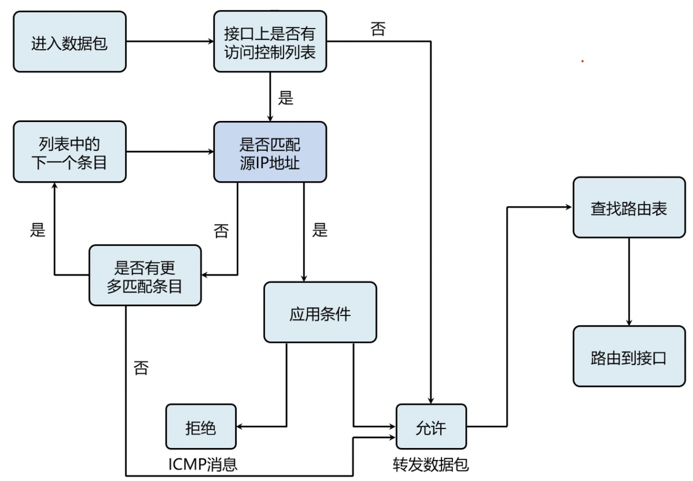
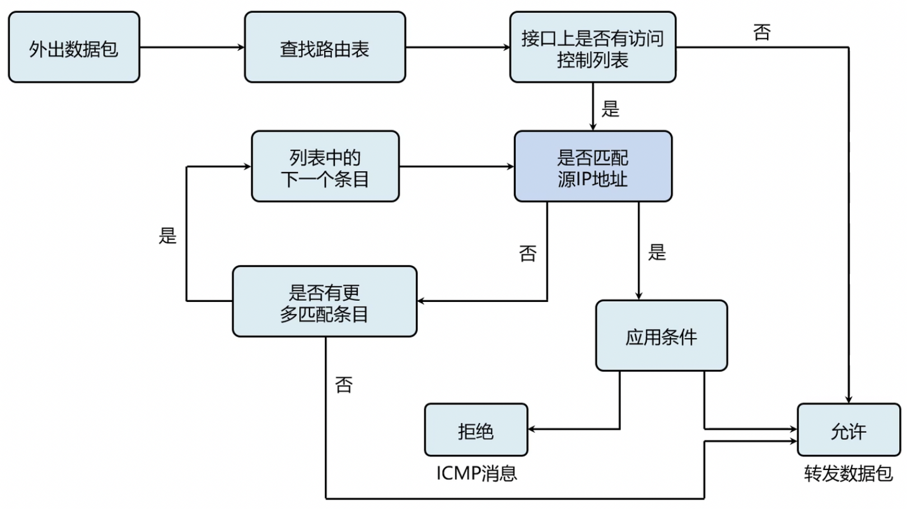

# 一、ACL的基本概念

1. ACL是工作在路由器接口级的指令，在接口上对所有入站/出站数据包进行过滤，筛选哪些包可以转发，哪些包需要被过滤。
2. ACL同时关注第三层（IP头部）与第四层（TCP/UDP头部）
3. 根据管理员预先定义好的规则，在接口上过滤数据。

# 二、ACL的主要功能

1. ACL提供了防火墙最基础的安全手段。
2. IPSec VPN在决定数据是否需要使用VPN传输时，需要ACL为其匹配感兴趣流量。
3. 在配置QoS时，同样需要调用ACL，使其达到控制流量的作用。
4. 在应用分布控制列表时，也需要使用ACL去定义流量。
5. 在配置防火墙实现单向通讯时，也需要使用ACL去匹配流量。

# 三、ACL的流量

1. 更具数据流的访问方向，在ACL中，存在【入】流量与【出】流量。
2. ACL的核心工作原理 — 包过滤
3. ACL关心第三层头部中的源IP地址与目标IP地址，还有第四层头部中的源端口号码与目标端口号码。
4. ACL根据上述的4元素进行精准过滤。
5. 华为的网络设备在配置ACL的时候，默认隐含【允许】；Cisco的网络设备默认隐含【拒绝】。

# 四、ACL的入方向与出方向

**入方向**



**出方向**



1. ALC既可以应用在【入】方向上，也可以应用在【出】方向上。
2. 当ACL应用在【入】方向上时，其先检查接口是否配置了ACL，在检查路由表项。
3. 当ACL应用在【出】方向上时，其先检查路由表项，再检查是否配置了ACL。
`结论：ACL应用在【入】方向更好，ACL可以应用在【出】方向。`

# 五、访问控制列表的配置

```bash
#创建访问控制列表
[Huawei]acl 2001
[Huawei-acl-basic-2001]rule deny source 192.168.10 0.0.0.255

#应用ACL
[Huawei]interface GigabitEthernet 0/0/0
[huawei-GigabitEthernet 0/0/0]traffic-filter inbound acl 2001
```

# 六、ACL的种类

1. 基本类型ACL【Cisco：标准ACL】
   1. 基本类型的ACL使用的表号为：2000-2999
   2. 基本类型的ACL仅仅只能够根据源IP地址进行访问控制过滤，提供最基础的网络防范手段。
2. 高级类型ACL【Cisco：扩展ACL】
   1. 高级类型的ACL能够同时根据源IP地址、目标IP地址、第四层协议（TCP/UDP）、四层协议所使用的服务端口号码，根据这4元素进行精准过滤和访问控制。
   2. 高级类型的的ACL使用的表号为3000 — 3999
3. 适配二层MAC的ACL【Cisco：基于MAC地址的ACL】
4. 基于时间的ACL【绝对时间、时间周期】

`注：ACL最好应用在距离信源最近的设备上,且应用将ACL应用在最近的设备的入方向上`

<table style="text-align:center;width:700px">
<tr style="background:rgb(238,133,109)">
	<td>端口号码</td><td>关键字</td><td>具体阐述</td><td>TCP/UDP</td>
</tr>
<tr>
	<td>20</td><td>FTP-Data</td><td>（文件传输协议）FTP（数据）</td><td>TCP</td>
</tr>
<tr>
	<td>21</td><td>FTP</td><td>（文件传输协议）FTP</td><td>TCP</td>
</tr>
<tr>
	<td>23</td><td>Telnet</td><td>终端连接</td><td>TCP</td>
</tr>
<tr>
	<td>25</td><td>SMTP</td><td>简单邮件传输协议</td><td>TCP</td>
</tr>
<tr>
	<td>41</td><td>NameServer</td><td>主机名服务</td><td>UDP</td>
</tr>
<tr>
	<td>53</td><td>Domain</td><td>域名服务（DNS）</td><td>TCP/UDP</td>
</tr>
<tr>
	<td>69</td><td>TFTP</td><td>简单文件传输协议（TFTP）</td><td>UDP</td>
</tr>
<tr>
	<td>80</td><td>www</td><td>万维网</td><td>TCP</td>
</tr>
</table>

# 七、ACL中的常见的服务

1. HTTP【超文本传输协议】：TCP 80
2. HTTPS【安全的超文本传输协议】：TCP 443
3. FTP【文件传输协议】：TCP 20/21
4. SMTP【简单邮件传输协议】：TCP 25
5. POP3【邮局协议版本3】：TCP 110
6. TFTP【简单文件传输协议】：UDP 69
7. DNS【域名系统】：TCP/UDP 53

# 八、ACL中的4个操作符

1. eq：等于
2. gt：大于
3. Lt：小于
4. neq：不等于

# 九、实验配置