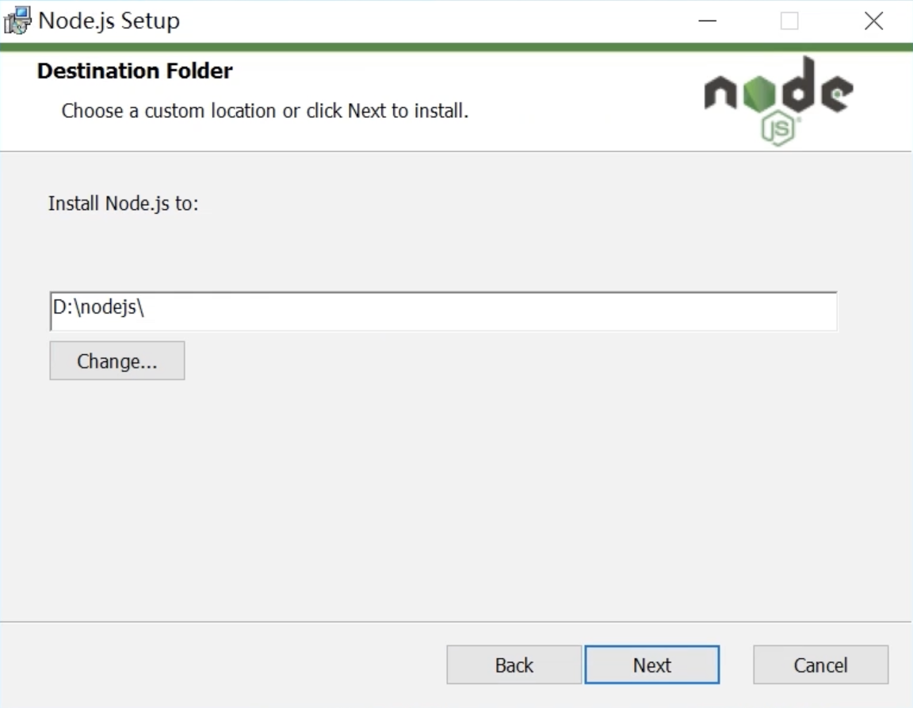
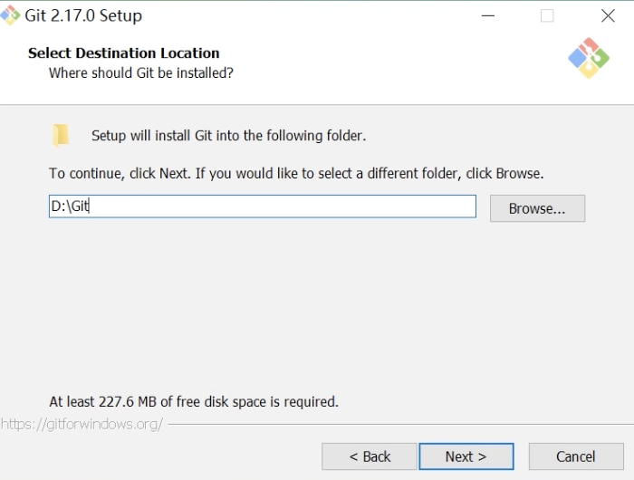
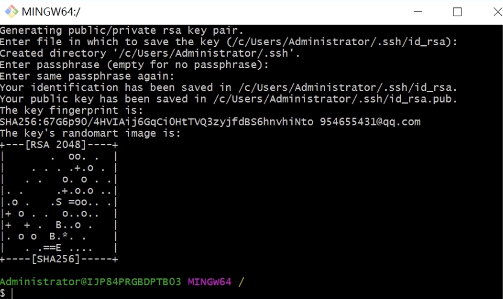
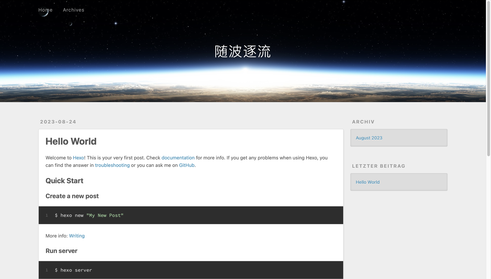

- 准备工作：
  - git账号
  - 本地安装git、nodejs(建议12.0以上)

官方文档 [https://hexo.io/zh-cn/](https://hexo.io/zh-cn/)

## Nodejs

下载[node.js](https://nodejs.org/en/download/releases)


后面的默认就可以了

安装完成后，在命令行输入`node -v`，出现版本号`v20.5.1`则表示安装成功。

## git

安装[git for windows](https://gitforwindows.org)


和上面一样，默认即可

安装完成后，在命令行输入`git -v`，出现版本号`git version 2.42.0`则表示安装成功。

### 配置SSH

```bash
$ ssh-keygen -t rsa -C "你的邮箱地址"
```


一直回车就可以了

然后将 **id_rsa.pub** 的内容复制到github的 SSH 中即可。

**测试ssh是否绑定成功**

```bash
#命令行中输入
$ ssh -T git@github.com

#出现这段话表示连接成功
#Hi shenlan823! You've successfully authenticated, but GitHub does not provide shell access.
```

## hexo

**一键部署**

```bash
$ npm install hexo-cli -g
$ hexo init blog
$ cd blog
$ npm install
$ hexo server -p 5555
```

在浏览器输入 *http://localhost:5555* 检查是否搭建成功



## 部署网站

### 1. 安装 [hexo-deployer-git](https://github.com/hexojs/hexo-deployer-git)

```bash
$ npm install hexo-deployer-git --save
```

### 2. 修改配置

```bash
#博客项目配置文件_config.yml(非主题配置文件)
url: https://shenlan823.github.io

deploy:
  type: git
  repo: <repository url> #https://bitbucket.org/JohnSmith/johnsmith.bitbucket.io
  branch: [branch]
```

### 3. 生成静态页面

```bash
$ hexo generate
```

### 4. 部署网站

```bash
$ hexo deploy
```

### 5. 查看网站

   在浏览器输入 [https://shenlan823.github.io](https://shenlan823.github.io)

## 更换模版

以本模版为例

[选择模版 https://hexo.io/themes/](https://hexo.io/themes/)

下载模版，解压到 `/blog/themes` 下，并改名 oranges。

```bash
#在hexo根配置文件 _config.yml 中设置你的主题
themes: oranges
```

模版地址：[Oranges](https://github.com/zchengsite/hexo-theme-oranges)
